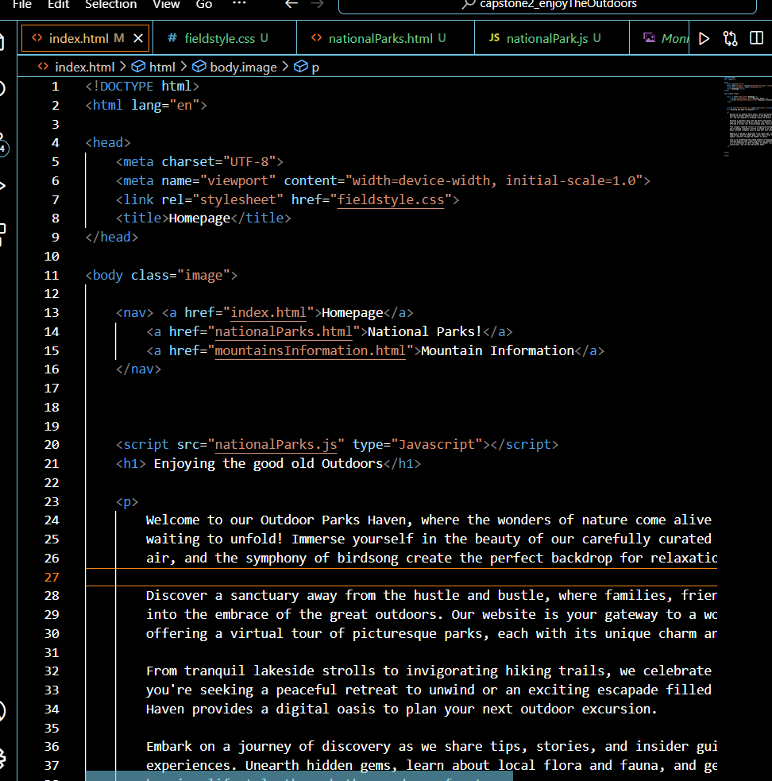

# Capstone 2: Enjoy the Outdoors

Description:
- HTML,CSS and JS project
- it involves finding national parks using dropdowns
- there are threee pages, home,search by location/type, search by mountains page

During this capstone project it was a journey and difficult but I was able to comeplete more than I would 2 weeks ago. So I have a blend of HTML, CSS, and JS which was my least favorite for now. My mission is to  design and  create a functional website that will helps users find things to do in the great outdoors. 

## Pages

I have a homepage, National Parks, and the forbidden Mountain Page. Insider joke why the Mountain page is forbidden.

## Collaboration
Fellow Developers
Mr.Greg
My dear friend and honorary donor GoogleFu

## Travel

